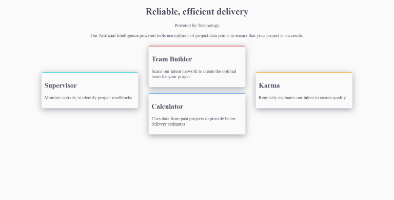

# Four-cards
***
Le projet "Four-cards" a pour objectif de prendre en main les propriété flex et grid pour offrir un design atractiv et responssive.

## Table des matières
1. [Utilisation](#utilisation)
2. [Technologies](#technologies)
3. [Captures d'écran](#captures-décran)

### Utilisation
***
Pour utiliser l'application, suivez ces étapes :

1. Allez sur la page [Four cards](https://tess-mltx.github.io/four-cards/).
2. Diminuer la taille de la page pour observer l'adaptation du design.

### Captures d'écran
***

## Technologies
***
Liste des technologies utilisées dans le projet :
* Ce projet est fait en SCSS

